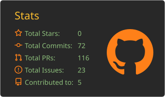
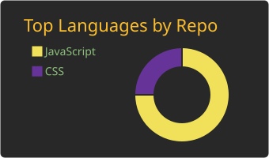

### Hi there, I'm Akhil 👋
**Senior Member of Technical Staff (SMTS) at [Salesforce](https://www.salesforce.com/)** · Enterprise integration systems & AI-assisted engineering tooling

- 🔭 I diagnose and fix production issues across large-scale data connector portfolios used by Fortune 500 companies
- 🤖 I build AI-powered diagnostic frameworks that turn deep root-cause analysis into a repeatable, automated process
- 🌱 Lucky to be an Apache Committer (Apache Ambari)
- 💬 Ask me about Java, Python, Kafka, AWS, root-cause analysis and AI agents
- 📫 How to reach me: akhilsnaikk@gmail.com · asnaik@apache.org
- ⚡ Fun fact: I Google until Yahoo bings 😂

🌐 **Portfolio:** [akhilsnaik.github.io](https://akhilsnaik.github.io/)

### 👨‍💻 About Me
I work on distributed integration systems at enterprise scale: database, cloud storage, messaging-queue and file-transfer connectors used by Fortune 500 companies in banking, retail, insurance and manufacturing.

I care about **closing the loop, not just closing the ticket**. Every fix I ship aims to stop the same class of failure from coming back. With AI tooling I build on clean, portable architecture while the ecosystem settles, and commit more deeply once the right platform is clear.

### 🛠️ What I Do
- **Root-cause analysis:** I trace production incidents from application logs down to the exact line of source code, across credential/authentication handling, connection pooling, message-queue polling, encryption and file-transfer protocols.
- **Durable fixes:** I ship dozens of bug fixes per half-year cycle that permanently close recurring failure patterns instead of patching individual tickets.
- **AI-assisted diagnostics:** I designed and built a framework of specialized AI agents, one per technology domain (cloud infrastructure, databases, messaging, cryptography, file transfer). It identifies the exact software version involved, cross-references live logs against the source code, and pinpoints the responsible code location. It cut investigation time significantly and is now production tooling used across my team.
- **Portable plugin architecture:** I'm leading that tooling's move to a standardized, extensible plugin architecture that works across AI runtimes and IDEs rather than being locked to one platform.

### 📈 Impact (last 6 months)
| | |
|---|---|
| **50+** | customer-reported production issues resolved across a large integration portfolio |
| **100%** | SLA compliance on all my incident investigations |

### 🎯 Currently Focused On
- Expanding automated diagnostic coverage so supporting a new integration becomes a configuration change, not custom engineering
- Building evaluation frameworks that make AI-assisted diagnostic output measurably reliable
- Driving adoption of AI-native engineering workflows across my team

### 💼 Experience
**Salesforce**, *Senior Member of Technical Staff (SMTS), Enterprise Integrations & AI Tooling* · Feb 2024 – Present

**Cloudera (formerly Hortonworks)**, *Staff Software Engineer, Break/Fix & Automation* · May 2017 – Feb 2024
- Committer on Apache Ambari; contributor to Apache Zeppelin, YARN UI, Tez View, Hive Views and the HDFS Files View.
- Subject-matter expert for customer-reported issues on Ambari, shipping hotfixes and features on top of the open-source codebase.

**Huawei Technologies**, *Software Development Engineer → Senior SDE* · Dec 2012 – May 2017
- Built a web client for Huawei's OSS platform used by telecom operators worldwide, including topology visualization with HTML5 Canvas.

### 🧰 Core Skills
**Languages** 

**Integration & Backend** 

- Distributed integration systems, connector/adapter architectures
- Database integrations: relational DBs, stored procedures, connection pooling

**AI & Tooling**
- AI agent design for technical diagnostics
- Prompt engineering for domain-specific automation
- Multi-runtime / IDE-agnostic tooling architecture
- Evaluation frameworks for AI output reliability

**Practices**
- Root-cause analysis & production incident response
- Log analysis and code-level debugging at scale
- SLA-driven customer escalation management
- Technical documentation and cross-team enablement

**Tools & Platforms** 

-000000?style=flat-square&logo=splunk&logoColor=white)

### 🌍 Open Source
| Project | Role |
|---|---|
| [Apache Ambari](https://ambari.apache.org/) | Committer |
| [Apache Zeppelin](https://zeppelin.apache.org/) | Contributor |
| [Apache Hue](https://github.com/cloudera/hue) | Contributor |
| [Apache NiFi](https://nifi.apache.org/) | Contributor |

### 🚀 Side Projects
- **[Flip A Coin](https://akhilsnaik.github.io/flipacoin/)** ([code](https://github.com/akhilsnaik/flipacoin)): a free online coin-flip tool with a realistic 3D animation, spoken heads-or-tails result, dark/light theme, and a live global toss counter.
- **[Keyboard Smash](https://akhilsnaik.github.io/smashkeyboard/)** ([code](https://github.com/akhilsnaik/smashkeyboard)): a toddler-friendly page where any key or tap pops emoji that float away with a little sound.

### 📊 GitHub Stats
<!-- Cards are generated by .github/workflows/profile-cards.yml and committed to this repo -->

  
  

&nbsp;&nbsp;
&nbsp;&nbsp;

